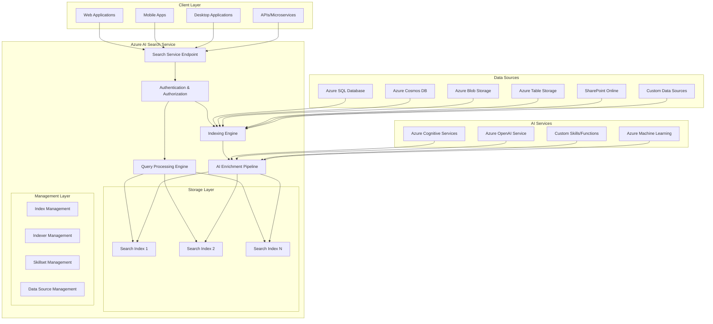
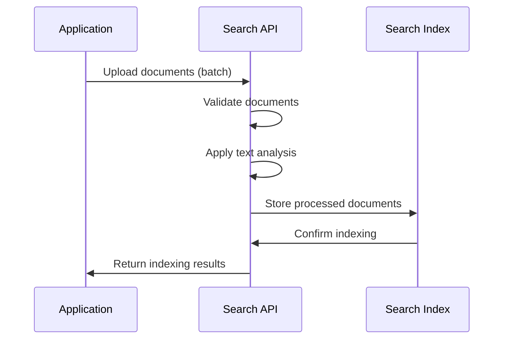
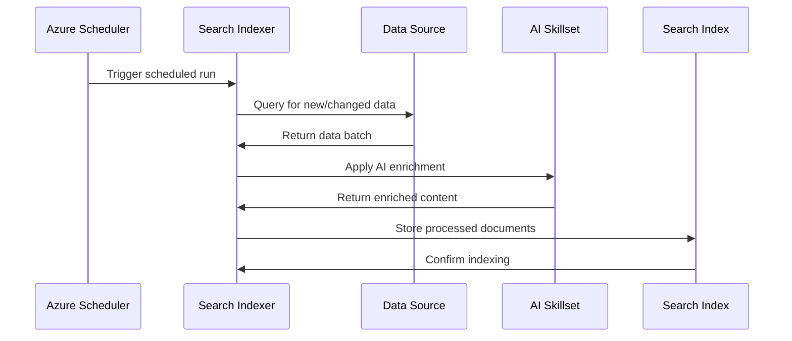
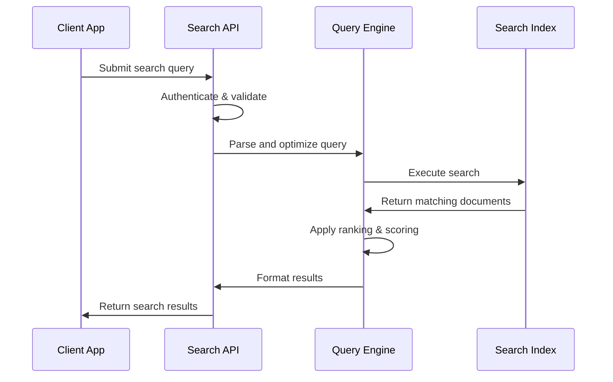

# Module 1: Introduction and Setup

[Go to top](#module-1-introduction-and-setup)

## Learning Objectives

By the end of this module, you will be able to:

- Understand what Azure AI Search is and its comprehensive capabilities
- Differentiate between Azure AI Search and other search solutions
- Set up an Azure AI Search service in the Azure portal with optimal configuration
- Configure multiple authentication methods and understand security best practices
- Validate your setup with comprehensive connection tests
- Understand the detailed architecture, components, and key concepts
- Plan capacity and pricing for your search solution
- Implement monitoring and diagnostics for your search service
- Troubleshoot common setup and configuration issues

[Go to top](#module-1-introduction-and-setup)

## Prerequisites

### Technical Requirements
- **Cloud Computing**: Basic understanding of cloud computing concepts and Azure fundamentals
- **Azure Subscription**: An active Azure subscription (free tier provides $200 credit and is sufficient for learning)
- **Development Environment**: 
  - Python 3.8 or higher installed on your local machine
  - Visual Studio Code or preferred IDE
  - Git for version control
- **API Knowledge**: Basic familiarity with REST APIs, JSON, and HTTP methods
- **Programming**: Basic understanding of Python programming concepts

### Recommended Background
- Experience with databases or data storage concepts
- Understanding of web applications and client-server architecture
- Familiarity with Azure portal navigation (helpful but not required)
- Basic knowledge of search concepts (indexing, querying, relevance)

[Go to top](#module-1-introduction-and-setup)

## What is Azure AI Search?

Azure AI Search (formerly Azure Cognitive Search) is Microsoft's cloud-based search-as-a-service solution that provides developers with comprehensive APIs and tools for building sophisticated search experiences. It's a Platform-as-a-Service (PaaS) offering that combines the simplicity of a fully managed service with enterprise-grade search capabilities, AI-powered content understanding, and vector search for modern applications.

## Why do you need Azure AI Search?
Imagine you have a large amount of data—documents, product catalogs, user profiles, or even images—and you want your users to find information quickly and easily. Just like how Google helps you find websites, Azure AI Search helps your app find information inside your own data.

Building such a search system on your own is complex and time-consuming. Azure AI Search simplifies this by managing the heavy lifting — such as indexing data, understanding queries, and ranking results — so you can focus on delivering great user experiences.

### Key concepts in Azure AI Search

- **Index** Think of an index like a supercharged library catalog. It’s a special structure that organizes your data to make searching fast. You create an index that describes the fields and data types you want to search on.
- **Documents** The actual pieces of data you want to search. For example, if your app indexes books, each book is a document with fields like title, author, and description.
- **Indexer** This is a tool that helps you automatically pull data from various sources (like Azure Blob Storage, Azure SQL, Cosmos DB, etc.) into your search index. It’s like an automatic librarian.
- **Queries** Users type search terms (queries), and Azure AI Search finds the most relevant documents based on those terms.
- **Ranking and Scoring** Azure AI Search uses algorithms to rank documents so that the most relevant ones appear first.
- **Cognitive Skills** Azure AI Search can also enrich your data with AI. For example, it can extract text from images, detect language, identify entities (people, places), translate text, and more before indexing it. This is powered by Azure Cognitive Services.

### How does Azure AI Search work?

- **Data Source** You start with data stored in various places like databases, files, or cloud storage.
- **Create an Index** Define what fields you want searchable and how they should behave (e.g., searchable text, filters, sortable fields).
- **Data Ingestion** Use indexers or push data directly to populate the index.
- **Enrichment (optional)** Apply AI-powered cognitive skills to extract more useful information from the raw data.
- **Search Queries** Users send search queries to the service via API or SDK.
- **Results Returned** The service returns ranked, filtered, and paged results based on relevance.

### Evolution and Positioning

Azure AI Search represents the evolution of traditional search engines, incorporating:
- **Traditional full-text search** with advanced linguistic analysis
- **AI-powered content enrichment** using Azure Cognitive Services
- **Vector search capabilities** for semantic understanding and similarity matching
- **Hybrid search approaches** combining keyword and vector search
- **Integration with Azure ecosystem** including Azure OpenAI, Cognitive Services, and data platforms

### Comprehensive Feature Set

#### Core Search Capabilities
- **Full-text search**: Advanced text search with BM25 relevance scoring, phrase matching, and proximity search
- **Fuzzy search**: Handle typos and variations with configurable edit distance
- **Wildcard and regex search**: Pattern matching for complex queries
- **Faceted navigation**: Multi-dimensional filtering with hierarchical facets
- **Geo-spatial search**: Location-based queries with distance calculations
- **Auto-complete and suggestions**: Real-time query suggestions and auto-completion
- **Highlighting**: Search term highlighting in results with customizable formatting

#### AI and Machine Learning Features
- **AI-powered enrichment**: Extract insights from unstructured content using 30+ built-in cognitive skills
- **Custom skills**: Integrate your own AI models and processing logic
- **Vector search**: Support for semantic search using vector embeddings from Azure OpenAI or custom models
- **Semantic search**: Enhanced relevance using Microsoft's semantic models
- **Knowledge mining**: Extract structured information from unstructured documents
- **Image analysis**: OCR, image classification, and content extraction from images

#### Enterprise Features
- **Multi-language support**: Built-in analyzers for 56 languages with cultural-specific processing
- **Security**: Role-based access control, API key management, and network security
- **Scalability**: Automatic scaling with configurable replicas and partitions
- **High availability**: 99.9% SLA with geo-redundant options
- **Monitoring**: Comprehensive logging, metrics, and alerting through Azure Monitor
- **Compliance**: SOC 2, ISO 27001, HIPAA, and other compliance certifications

#### Developer Experience
- **Multiple SDKs**: .NET, Python, Java, JavaScript, and REST APIs
- **Rich query syntax**: OData-based filtering with advanced operators
- **Batch operations**: Efficient bulk indexing and updates
- **Real-time indexing**: Near real-time document updates
- **Testing tools**: Built-in search explorer and query testing capabilities

### Core Concepts and Architecture

#### Search Service
A search service is the top-level Azure resource that hosts your search indexes and handles all search operations. Each service provides:

**Service Characteristics:**

- **Unique URL endpoint**: `https://[service-name].search.windows.net`
- **Dedicated capacity**: Configurable search units (replicas × partitions)
- **Geographic location**: Choose region for data residency and latency optimization
- **Pricing tier**: From Free to Storage Optimized based on requirements
- **Security boundary**: Isolated environment with dedicated authentication

**Service Limits by Tier:**

- **Free**: 3 indexes, 50MB storage, 10,000 documents per index
- **Basic**: 15 indexes, 2GB storage, 1 million documents per index
- **Standard (S1-S3)**: Up to 200 indexes, scalable storage, millions of documents
- **Storage Optimized (L1-L2)**: Optimized for large document collections

#### Search Index
An index is a persistent, searchable collection of documents with a defined schema. Key characteristics:

**Index Components:**

- **Schema definition**: Field types, attributes, and analyzers
- **Documents**: JSON objects containing your searchable content
- **Scoring profiles**: Custom relevance algorithms
- **Analyzers**: Language-specific text processing rules
- **Suggesters**: Configuration for auto-complete functionality
- **CORS policies**: Cross-origin resource sharing settings

**Field Types and Attributes:**

- **Edm.String**: Text fields with full-text search capabilities
- **Edm.Int32/Int64**: Numeric fields for filtering and sorting
- **Edm.Double**: Floating-point numbers for calculations
- **Edm.Boolean**: True/false values for binary filtering
- **Edm.DateTimeOffset**: Date and time values with timezone support
- **Edm.GeographyPoint**: Geographic coordinates for spatial search
- **Collection(Edm.String)**: Arrays of strings for multi-value fields
- **Edm.ComplexType**: Nested objects for structured data

**Field Attributes:**

- **Searchable**: Enable full-text search on the field
- **Filterable**: Allow filtering operations (eq, ne, gt, lt, etc.)
- **Sortable**: Enable sorting by field values
- **Facetable**: Support faceted navigation
- **Retrievable**: Include field in search results
- **Key**: Unique identifier for each document

#### Documents
Documents are the individual items stored in your search index, represented as JSON objects:

**Document Structure:**
```json
{
  "id": "unique-document-id",
  "title": "Document Title",
  "content": "Full text content for searching",
  "category": "Document Category",
  "tags": ["tag1", "tag2", "tag3"],
  "publishDate": "2024-01-15T10:30:00Z",
  "location": {
    "type": "Point",
    "coordinates": [-122.131577, 47.678581]
  },
  "metadata": {
    "author": "Author Name",
    "version": "1.0"
  }
}
```

**Document Operations:**

- **Upload**: Add new documents to the index
- **Merge**: Update specific fields in existing documents
- **MergeOrUpload**: Update if exists, create if doesn't exist
- **Delete**: Remove documents from the index

#### Indexers and Data Sources
Indexers provide automated data ingestion from various sources:

**Supported Data Sources:**

- **Azure SQL Database**: Relational data with change tracking
- **Azure Cosmos DB**: NoSQL documents with automatic indexing
- **Azure Blob Storage**: Files, documents, and unstructured content
- **Azure Table Storage**: Semi-structured data
- **Azure Data Lake Storage Gen2**: Big data scenarios
- **SharePoint Online**: Documents and lists (preview)

**Indexer Features:**

- **Scheduled execution**: Automatic updates on defined intervals
- **Change detection**: Incremental updates based on data source changes
- **Field mappings**: Transform source data to match index schema
- **Skillsets**: Apply AI enrichment during indexing
- **Error handling**: Robust error reporting and retry mechanisms

#### Skillsets and AI Enrichment
Skillsets define AI processing pipelines for content enrichment:

**Built-in Cognitive Skills:**

- **Text skills**: Key phrase extraction, language detection, sentiment analysis
- **Image skills**: OCR, image analysis, face detection
- **Content skills**: Entity recognition, PII detection, document extraction
- **Utility skills**: Conditional logic, text splitting, shaping

**Custom Skills:**

- **Azure Functions**: Serverless custom processing
- **Azure Machine Learning**: ML model integration
- **Web API**: External service integration
- **Power Skills**: Community-contributed skills

#### Vector Search and Embeddings
Modern search capabilities using vector representations:

**Vector Search Features:**

- **Embedding generation**: Integration with Azure OpenAI embeddings
- **Similarity search**: Find semantically similar content
- **Hybrid search**: Combine keyword and vector search
- **Vector indexing**: Optimized storage and retrieval of embeddings
- **Multiple vector fields**: Support for different embedding models

**Supported Vector Algorithms:**

- **HNSW (Hierarchical Navigable Small World)**: Fast approximate nearest neighbor search
- **Exhaustive KNN**: Exact nearest neighbor for smaller datasets

[Go to top](#module-1-introduction-and-setup)

## Setting Up Azure AI Search

For detailed setup instructions, including service creation, authentication configuration, and development environment setup, see the [Azure AI Search Setup Guide](../../setup/azure-ai-search-setup.md).

The setup guide covers:
- **Service Creation**: Step-by-step Azure portal setup with all configuration options
- **Authentication Methods**: API keys, Azure AD, and managed identity configuration
- **Development Environment**: Python SDK installation and project structure
- **Connection Testing**: Comprehensive testing scripts and validation
- **Security Best Practices**: Network security, key management, and access control

For comprehensive troubleshooting guidance, see the [Troubleshooting Guide](../../reference/troubleshooting.md).

[Go to top](#module-1-introduction-and-setup)

## Next Steps

Now that you have Azure AI Search set up and understand the basic concepts, you're ready to:

1. Create your first search index (Module 2)
2. Add documents to the index
3. Perform basic search operations
4. Explore advanced features like faceting and filtering

In the next module, we'll dive into basic search operations and learn how to perform simple queries against your search service.

[Go to top](#module-1-introduction-and-setup)

## Additional Resources and Learning Materials


   
    - **Free Tier (F0)**:

        - **Cost**: No charge
        - **Limits**: 3 indexes, 50MB storage, 10,000 documents per index
        - **Best for**: Learning, prototyping, small demos
        - **Limitations**: No SLA, limited query volume, no scaling
   
    - **Basic Tier (B)**:

        - **Cost**: ~$250/month
        - **Capacity**: 15 indexes, 2GB storage, 1 million documents per index
        - **Features**: 3 replicas max, 1 partition, 99.9% SLA
        - **Best for**: Small production workloads, development environments
   
    - **Standard Tiers (S1, S2, S3)**:

        - **S1**: ~$250/month, 25GB storage, 12 partitions, 12 replicas
        - **S2**: ~$1000/month, 100GB storage, 12 partitions, 12 replicas  
        - **S3**: ~$2000/month, 200GB storage, 12 partitions, 12 replicas
        - **Features**: Full feature set, high availability, custom scaling
        - **Best for**: Production workloads with varying scale requirements
   
    - **Storage Optimized (L1, L2)**:
        - **L1**: ~$2500/month, 1TB storage, optimized for large document collections
        - **L2**: ~$5000/month, 2TB storage, maximum storage capacity
        - **Best for**: Large-scale document repositories, archival search

- **Advanced Configuration Options**   
    - **Networking:**
        - **Public endpoint**: Accessible from internet (default)
        - **Private endpoint**: Restrict access to virtual network
        - **IP restrictions**: Limit access to specific IP ranges
   
    - **Identity:**
        - **System-assigned managed identity**: Enable for Azure service integration
        - **User-assigned managed identity**: Use existing managed identity
   
    - **Encryption:**
        - **Microsoft-managed keys**: Default encryption (recommended for most scenarios)
        - **Customer-managed keys**: Use your own encryption keys for additional control

- **Review and Create**
    - Review all configuration settings
    - Estimate monthly costs using the pricing calculator
    - Add tags for resource organization and cost tracking
    - Click "Create" to deploy the service
    - Deployment typically takes 2-5 minutes

#### Post-Deployment Verification

After deployment completes:

- **Navigate to your service**
    - Go to "All resources" or use the notification to access your service
    - Bookmark the service URL for easy access

- **Verify service status**
    - Check that the service shows "Running" status
    - Note the service URL format: `https://[service-name].search.windows.net`

- **Review service properties**
    - **Overview**: Service URL, status, pricing tier, location
    - **Activity log**: Deployment history and operations
    - **Access control (IAM)**: User permissions and role assignments

[Go to top](#module-1-introduction-and-setup)

### Step 2: Gather Connection Information and Configure Access

#### Service Connection Details

- **Navigate to your search service**
    - From Azure portal home, go to "All resources"
    - Find your search service (filter by type "Search service" if needed)
    - Click on the service name to open the overview page

- **Document your service URL**
    - Found in the "Overview" section under "Url"
    - Format: `https://[your-service-name].search.windows.net`
    - **Important**: This URL is case-sensitive and must be used exactly as shown
    - Test accessibility by opening the URL in a browser (should show a JSON response)

- **Understand API Key Management**
    - Click on "Keys" in the left navigation menu
    - Azure AI Search uses two types of API keys for authentication:

#### API Key Types and Management

- **Admin Keys (Full Access)**
    - **Primary admin key**: Full read/write access to service and data 
    - **Secondary admin key**: Identical permissions, used for key rotation
    - **Capabilities**: 
        - Create, update, delete indexes
        - Upload, modify, delete documents
        - Query data
        - Manage service configuration
    - **Security**: Treat as highly sensitive credentials
    - **Rotation**: Regularly rotate keys (recommended monthly for production)

- **Query Keys (Read-Only Access)**
    - **Default query key**: Automatically created, read-only access
    - **Custom query keys**: Create up to 50 additional query keys
    - **Capabilities**:
        - Search and query operations only
        - Cannot modify indexes or documents
        - Cannot access service configuration
    - **Use cases**: Client-side applications, public-facing search interfaces
    - **Management**: Can be created, named, and deleted as needed

#### Key Rotation Best Practices

- **Implement key rotation strategy**:
    ```bash
    # Example rotation process
    # 1. Update application to use secondary key
    # 2. Regenerate primary key
    # 3. Update application to use new primary key
    # 4. Regenerate secondary key
    ```

- **Monitor key usage**:
    - Use Azure Monitor to track API calls
    - Set up alerts for unusual access patterns
    - Log key usage for security auditing

#### Advanced Authentication Options

- **Azure Active Directory (Azure AD) Authentication**
    - **Setup process**:
        1. Navigate to "Access control (IAM)" in your search service
        2. Click "Add role assignment"
        3. Select appropriate role:
            - **Search Service Contributor**: Full service management
            - **Search Index Data Contributor**: Index and document management
            - **Search Index Data Reader**: Read-only access to data
        4. Assign to users, groups, or service principals

- **Benefits**:
    - No API key management required
    - Integration with existing identity systems
    - Fine-grained role-based access control
    - Audit trail through Azure AD logs

- **Managed Identity Authentication**
    - **System-assigned managed identity**: Automatically created with the service
    - **User-assigned managed identity**: Shared across multiple resources
    - **Configuration**:
        1. Enable managed identity in service "Identity" settings
        2. Grant appropriate permissions to target resources
        3. Use identity for accessing data sources or other Azure services

#### Network Security Configuration

- **IP Restrictions**
    1. Navigate to "Networking" in your search service
    2. Select "Selected networks"
    3. Add IP address ranges that should have access
    4. Consider adding your development machine's IP for testing

- **Private Endpoints**
    1. Click "Private endpoint connections"
    2. Create private endpoint to restrict access to virtual network
    3. Configure DNS resolution for private endpoint
    4. Update applications to use private endpoint URL

- **Firewall Rules**
    - Configure at the service level to restrict access
    - Can be combined with private endpoints for defense in depth
    - Consider impact on indexers accessing external data sources

[Go to top](#module-1-introduction-and-setup)

### Step 3: Set Up Your Development Environment

#### Python Environment Setup

1. **Create a virtual environment (recommended)**
   ```bash
   # Create virtual environment
   python -m venv azure-search-env
   
   # Activate virtual environment
   # On Windows:
   azure-search-env\Scripts\activate
   # On macOS/Linux:
   source azure-search-env/bin/activate
   ```

2. **Install required Python packages**
   ```bash
   # Core Azure AI Search SDK
   pip install azure-search-documents==11.4.0
   
   # Additional useful packages
   pip install python-dotenv==1.0.0      # Environment variable management
   pip install requests==2.31.0          # HTTP requests
   pip install azure-identity==1.15.0    # Azure AD authentication
   pip install azure-core==1.29.0        # Azure SDK core functionality
   pip install pandas==2.1.0             # Data manipulation (optional)
   pip install jupyter==1.0.0            # Jupyter notebooks (optional)
   ```

3. **Create requirements.txt for reproducibility**
   ```bash
   pip freeze > requirements.txt
   ```

#### Environment Configuration

**Create comprehensive .env file**
Create a `.env` file in your project root with all necessary configuration:

```bash
# Azure AI Search Service Configuration
AZURE_SEARCH_SERVICE_ENDPOINT=https://[your-service-name].search.windows.net
AZURE_SEARCH_SERVICE_NAME=[your-service-name]
AZURE_SEARCH_ADMIN_KEY=[your-admin-key]
AZURE_SEARCH_QUERY_KEY=[your-query-key]

# Optional: Azure AD Configuration
AZURE_TENANT_ID=[your-tenant-id]
AZURE_CLIENT_ID=[your-client-id]
AZURE_CLIENT_SECRET=[your-client-secret]

# Development Settings
ENVIRONMENT=development
LOG_LEVEL=INFO
TIMEOUT_SECONDS=30

# Optional: Additional Azure Services
AZURE_STORAGE_CONNECTION_STRING=[for-blob-storage-integration]
AZURE_OPENAI_ENDPOINT=[for-vector-search]
AZURE_OPENAI_API_KEY=[for-embeddings]
```

**Environment file security**
```bash
# Add .env to .gitignore to prevent committing secrets
echo ".env" >> .gitignore
echo "*.env" >> .gitignore
echo "__pycache__/" >> .gitignore
```

#### Comprehensive Connection Testing

**Basic connection test script**
Create `test_connection.py`:

```python
#!/usr/bin/env python3
"""
Comprehensive Azure AI Search connection testing script
"""
import os
import sys
from datetime import datetime
from azure.search.documents import SearchClient
from azure.search.documents.indexes import SearchIndexClient
from azure.core.credentials import AzureKeyCredential
from azure.core.exceptions import AzureError
from dotenv import load_dotenv

def load_configuration():
    """Load and validate configuration from environment"""
    load_dotenv()
    
    config = {
        'endpoint': os.getenv('AZURE_SEARCH_SERVICE_ENDPOINT'),
        'admin_key': os.getenv('AZURE_SEARCH_ADMIN_KEY'),
        'query_key': os.getenv('AZURE_SEARCH_QUERY_KEY'),
        'service_name': os.getenv('AZURE_SEARCH_SERVICE_NAME')
    }
    
    # Validate required configuration
    missing_config = [key for key, value in config.items() 
                     if not value and key != 'query_key']
    
    if missing_config:
        print(f"❌ Missing configuration: {', '.join(missing_config)}")
        print("Please check your .env file")
        return None
    
    return config

def test_service_connection(config):
    """Test basic service connectivity"""
    print("🔍 Testing service connection...")
    
    try:
        # Create index client for service-level operations
        credential = AzureKeyCredential(config['admin_key'])
        index_client = SearchIndexClient(
            endpoint=config['endpoint'],
            credential=credential
        )
        
        # Test service connectivity by getting service statistics
        service_stats = index_client.get_service_statistics()
        
        print("✅ Service connection successful!")
        print(f"   Service endpoint: {config['endpoint']}")
        print(f"   Storage used: {service_stats['storage_size']} bytes")
        print(f"   Document count: {service_stats['document_count']}")
        print(f"   Index count: {service_stats['index_count']}")
        
        return True
        
    except AzureError as e:
        print(f"❌ Service connection failed: {e}")
        return False
    except Exception as e:
        print(f"❌ Unexpected error: {e}")
        return False

def test_authentication_methods(config):
    """Test different authentication methods"""
    print("\n🔐 Testing authentication methods...")
    
    # Test admin key
    try:
        admin_credential = AzureKeyCredential(config['admin_key'])
        admin_client = SearchIndexClient(
            endpoint=config['endpoint'],
            credential=admin_credential
        )
        admin_client.get_service_statistics()
        print("✅ Admin key authentication successful")
    except Exception as e:
        print(f"❌ Admin key authentication failed: {e}")
    
    # Test query key if available
    if config['query_key']:
        try:
            query_credential = AzureKeyCredential(config['query_key'])
            # Query keys can't access service statistics, so we'll test differently
            print("✅ Query key loaded (limited testing without existing index)")
        except Exception as e:
            print(f"❌ Query key authentication failed: {e}")

def test_sdk_functionality(config):
    """Test SDK functionality and features"""
    print("\n🛠️  Testing SDK functionality...")
    
    try:
        credential = AzureKeyCredential(config['admin_key'])
        index_client = SearchIndexClient(
            endpoint=config['endpoint'],
            credential=credential
        )
        
        # Test listing indexes
        indexes = list(index_client.list_indexes())
        print(f"✅ Successfully retrieved {len(indexes)} indexes")
        
        if indexes:
            for idx in indexes[:3]:  # Show first 3 indexes
                print(f"   - Index: {idx.name} ({len(idx.fields)} fields)")
        
        # Test getting service statistics
        stats = index_client.get_service_statistics()
        print(f"✅ Service statistics retrieved")
        
        return True
        
    except Exception as e:
        print(f"❌ SDK functionality test failed: {e}")
        return False

def generate_connection_report(config):
    """Generate a comprehensive connection report"""
    print("\n📊 Connection Report")
    print("=" * 50)
    print(f"Timestamp: {datetime.now().isoformat()}")
    print(f"Service Name: {config['service_name']}")
    print(f"Endpoint: {config['endpoint']}")
    print(f"Admin Key: {'✅ Configured' if config['admin_key'] else '❌ Missing'}")
    print(f"Query Key: {'✅ Configured' if config['query_key'] else '⚠️  Optional'}")
    print("=" * 50)

def main():
    """Main testing function"""
    print("🚀 Azure AI Search Connection Test")
    print("=" * 50)
    
    # Load configuration
    config = load_configuration()
    if not config:
        sys.exit(1)
    
    # Generate report
    generate_connection_report(config)
    
    # Run tests
    tests_passed = 0
    total_tests = 3
    
    if test_service_connection(config):
        tests_passed += 1
    
    test_authentication_methods(config)
    tests_passed += 1  # Authentication test always counts as passed if no exception
    
    if test_sdk_functionality(config):
        tests_passed += 1
    
    # Final results
    print(f"\n🎯 Test Results: {tests_passed}/{total_tests} tests passed")
    
    if tests_passed == total_tests:
        print("🎉 All tests passed! Your Azure AI Search setup is ready.")
        print("\n📋 Next steps:")
        print("1. Create your first search index")
        print("2. Add some sample documents")
        print("3. Perform your first search query")
    else:
        print("⚠️  Some tests failed. Please check your configuration.")
        sys.exit(1)

if __name__ == "__main__":
    main()
```

**Run the connection test**
```bash
python test_connection.py
```

#### Development Tools Setup

- **Visual Studio Code Extensions**
    Install these helpful extensions:
    - **Python**: Microsoft's official Python extension
    - **Azure Account**: Sign in to Azure from VS Code
    - **Azure Resources**: Manage Azure resources
    - **REST Client**: Test REST API calls
    - **JSON**: Enhanced JSON editing and validation

- **Create VS Code workspace settings**
    Create `.vscode/settings.json`:
    ```json
    {
        "python.defaultInterpreterPath": "./azure-search-env/bin/python",
        "python.terminal.activateEnvironment": true,
        "files.exclude": {
            "**/__pycache__": true,
            "**/*.pyc": true,
            ".env": false
        },
        "python.linting.enabled": true,
        "python.linting.pylintEnabled": true,
        "python.formatting.provider": "black"
    }
    ```

#### Project Structure Setup

**Create organized project structure**
```bash
mkdir -p azure-search-project/{src,tests,docs,examples,data}
cd azure-search-project

# Create initial files
touch src/__init__.py
touch tests/__init__.py
touch README.md
touch requirements.txt
```

**Example project structure**:
```
azure-search-project/
├── .env                    # Environment configuration
├── .gitignore             # Git ignore rules
├── requirements.txt       # Python dependencies
├── README.md             # Project documentation
├── test_connection.py    # Connection testing script
├── src/                  # Source code
│   ├── __init__.py
│   ├── search_client.py  # Search client wrapper
│   └── utils.py          # Utility functions
├── tests/                # Test files
│   ├── __init__.py
│   └── test_search.py    # Unit tests
├── examples/             # Example scripts
│   ├── basic_search.py
│   └── index_management.py
├── docs/                 # Documentation
└── data/                 # Sample data files
```

## Authentication Methods and Security

Azure AI Search supports multiple authentication methods, each suited for different scenarios and security requirements.

### 1. API Keys (Recommended for Development and Simple Scenarios)

#### Admin Keys
- **Purpose**: Full administrative access to the search service
- **Capabilities**: 
    - Create, update, delete indexes and indexers
    - Upload, modify, delete documents
    - Query data and retrieve results
    - Manage service configuration and settings
    - Access service statistics and diagnostics
- **Key Management**: 
    - Two admin keys provided (primary and secondary)
    - Enable zero-downtime key rotation
    - Keys are 32-character alphanumeric strings
- **Security Considerations**:
    - Treat as highly sensitive credentials
    - Never embed in client-side code
    - Store securely using Azure Key Vault or environment variables
    - Rotate regularly (monthly recommended for production)

#### Query Keys
- **Purpose**: Read-only access for search operations
- **Capabilities**:
    - Search and query operations only
    - Retrieve documents and search results
    - Access auto-complete and suggestions
    - Cannot modify indexes or documents
- **Key Management**:
    - Up to 50 query keys per service
    - Can be named for easier management
    - Can be created and deleted as needed
    - Default query key created automatically
- **Use Cases**:
    - Client-side applications and websites
    - Mobile applications
    - Public-facing search interfaces
    - Third-party integrations with read-only access

**Implementation Example**:
```python
from azure.search.documents import SearchClient
from azure.core.credentials import AzureKeyCredential

# Admin key usage (server-side only)
admin_credential = AzureKeyCredential("your-admin-key")
admin_client = SearchClient(
    endpoint="https://your-service.search.windows.net",
    index_name="your-index",
    credential=admin_credential
)

# Query key usage (can be used client-side)
query_credential = AzureKeyCredential("your-query-key")
search_client = SearchClient(
    endpoint="https://your-service.search.windows.net",
    index_name="your-index",
    credential=query_credential
)
```

### 2. Azure Active Directory (Azure AD) - Recommended for Production

#### Overview
Azure AD authentication provides enterprise-grade security with role-based access control (RBAC) and integration with existing identity systems.

#### Built-in Roles
- **Search Service Contributor**: Full service management capabilities
- **Search Index Data Contributor**: Read/write access to indexes and documents
- **Search Index Data Reader**: Read-only access to search data
- **Reader**: View service properties and statistics only

#### Setup Process
1. **Enable Azure AD authentication**:
   ```bash
   # Using Azure CLI
   az search service update \
     --name "your-search-service" \
     --resource-group "your-resource-group" \
     --aad-auth-failure-mode "http401WithBearerChallenge"
   ```

2. **Assign roles to users/applications**:
   ```bash
   # Assign Search Index Data Reader role
   az role assignment create \
     --assignee "user@domain.com" \
     --role "Search Index Data Reader" \
     --scope "/subscriptions/{subscription-id}/resourceGroups/{resource-group}/providers/Microsoft.Search/searchServices/{service-name}"
   ```

3. **Application registration** (for service principals):
   - Register application in Azure AD
   - Generate client secret or certificate
   - Assign appropriate search service roles

#### Implementation Examples

**Using DefaultAzureCredential (Recommended)**:
```python
from azure.search.documents import SearchClient
from azure.identity import DefaultAzureCredential

# Automatically uses available credentials (managed identity, Azure CLI, etc.)
credential = DefaultAzureCredential()
client = SearchClient(
    endpoint="https://your-service.search.windows.net",
    index_name="your-index",
    credential=credential
)
```

**Using Service Principal**:
```python
from azure.search.documents import SearchClient
from azure.identity import ClientSecretCredential

credential = ClientSecretCredential(
    tenant_id="your-tenant-id",
    client_id="your-client-id",
    client_secret="your-client-secret"
)

client = SearchClient(
    endpoint="https://your-service.search.windows.net",
    index_name="your-index",
    credential=credential
)
```

**Using Interactive Authentication**:
```python
from azure.search.documents import SearchClient
from azure.identity import InteractiveBrowserCredential

# Opens browser for user authentication
credential = InteractiveBrowserCredential()
client = SearchClient(
    endpoint="https://your-service.search.windows.net",
    index_name="your-index",
    credential=credential
)
```

### 3. Managed Identity (Recommended for Azure-hosted Applications)

#### System-Assigned Managed Identity
- **Characteristics**: Tied to the lifecycle of the Azure resource
- **Use Cases**: Azure Functions, App Service, Virtual Machines
- **Benefits**: No credential management, automatic cleanup

**Enable system-assigned managed identity**:
```bash
# For Azure App Service
az webapp identity assign \
  --name "your-app-name" \
  --resource-group "your-resource-group"

# For Azure Function App
az functionapp identity assign \
  --name "your-function-name" \
  --resource-group "your-resource-group"
```

#### User-Assigned Managed Identity
- **Characteristics**: Independent lifecycle, can be shared across resources
- **Use Cases**: Multiple applications needing same permissions
- **Benefits**: Centralized identity management, reusable across resources

**Create and assign user-assigned managed identity**:
```bash
# Create user-assigned managed identity
az identity create \
  --name "search-app-identity" \
  --resource-group "your-resource-group"

# Assign to App Service
az webapp identity assign \
  --name "your-app-name" \
  --resource-group "your-resource-group" \
  --identities "/subscriptions/{subscription-id}/resourcegroups/{resource-group}/providers/Microsoft.ManagedIdentity/userAssignedIdentities/search-app-identity"
```

**Implementation with Managed Identity**:
```python
from azure.search.documents import SearchClient
from azure.identity import ManagedIdentityCredential

# System-assigned managed identity
credential = ManagedIdentityCredential()

# User-assigned managed identity
credential = ManagedIdentityCredential(
    client_id="your-user-assigned-identity-client-id"
)

client = SearchClient(
    endpoint="https://your-service.search.windows.net",
    index_name="your-index",
    credential=credential
)
```

### 4. Certificate-Based Authentication

For scenarios requiring certificate-based authentication:

```python
from azure.search.documents import SearchClient
from azure.identity import CertificateCredential

credential = CertificateCredential(
    tenant_id="your-tenant-id",
    client_id="your-client-id",
    certificate_path="path/to/certificate.pem"
)

client = SearchClient(
    endpoint="https://your-service.search.windows.net",
    index_name="your-index",
    credential=credential
)
```

### Security Best Practices

#### Key Management
1. **Use Azure Key Vault** for storing API keys and secrets
2. **Implement key rotation** policies and procedures
3. **Monitor key usage** through Azure Monitor and logging
4. **Separate keys by environment** (development, staging, production)

#### Access Control
1. **Principle of least privilege**: Grant minimum necessary permissions
2. **Use query keys** for client-side and read-only scenarios
3. **Implement IP restrictions** to limit access by location
4. **Enable private endpoints** for network-level security

#### Monitoring and Auditing
1. **Enable diagnostic logging** for authentication events
2. **Set up alerts** for unusual access patterns
3. **Regular access reviews** to ensure appropriate permissions
4. **Monitor failed authentication attempts**

#### Network Security
1. **Configure firewall rules** to restrict access by IP
2. **Use private endpoints** for internal network access
3. **Implement network security groups** for additional protection
4. **Consider VPN or ExpressRoute** for hybrid scenarios

### Authentication Decision Matrix

| Scenario | Recommended Method | Rationale |
|----------|-------------------|-----------|
| Development/Testing | API Keys | Simple setup, easy debugging |
| Production Web App | Azure AD + Managed Identity | No credential management, enterprise security |
| Client-side Search | Query Keys | Read-only access, safe for public exposure |
| Azure Functions | System-assigned Managed Identity | Automatic credential management |
| Multi-service App | User-assigned Managed Identity | Shared identity across services |
| On-premises Integration | Service Principal | Works across hybrid environments |
| High-security Environment | Certificate-based + Private Endpoints | Maximum security controls |

## Architecture Overview and Components

### High-Level Architecture

Azure AI Search follows a service-oriented architecture that separates concerns between data ingestion, processing, storage, and querying.



### Core Components Deep Dive

#### 1. Search Service Endpoint
The central entry point for all operations:

- **Responsibilities**:
    - Request routing and load balancing
    - Authentication and authorization
    - Rate limiting and throttling
    - Request/response transformation
    - Monitoring and logging

- **Service Tiers and Capacity**:
    - **Search Units (SU)**: Combination of replicas and partitions
    - **Replicas**: Handle query load and provide high availability
    - **Partitions**: Store data and handle indexing operations
    - **Scaling Formula**: Total SU = Replicas × Partitions

#### 2. Query Processing Engine
Handles all search and retrieval operations:

- **Query Types Supported**:
    - **Simple queries**: Basic keyword search with automatic query parsing
    - **Full Lucene queries**: Advanced syntax with field-specific search, wildcards, regex
    - **Vector queries**: Semantic similarity search using embeddings
    - **Hybrid queries**: Combination of keyword and vector search
    - **Faceted queries**: Aggregated results with filtering capabilities

- **Query Processing Pipeline**:
    1. **Query parsing**: Analyze and validate query syntax
    2. **Query expansion**: Apply synonyms, stemming, and linguistic analysis
    3. **Index selection**: Determine which indexes to search
    4. **Execution planning**: Optimize query execution strategy
    5. **Result ranking**: Apply relevance scoring algorithms
    6. **Response formatting**: Structure results according to request parameters

#### 3. Indexing Engine
Manages document ingestion and index maintenance:

- **Indexing Modes**:
    - **Push model**: Applications directly upload documents via REST API or SDK
    - **Pull model**: Indexers automatically crawl data sources on schedule
    - **Hybrid model**: Combination of push and pull for different data types

- **Indexing Pipeline**:
    1. **Document ingestion**: Receive documents from various sources
    2. **Field mapping**: Transform source data to match index schema
    3. **Text analysis**: Apply language analyzers and custom processing
    4. **AI enrichment**: Execute skillsets for content extraction and enhancement
    5. **Index storage**: Store processed documents in searchable format
    6. **Index optimization**: Maintain index performance and structure

#### 4. AI Enrichment Pipeline
Processes unstructured content using cognitive skills:

- **Enrichment Stages**:
    1. **Document cracking**: Extract text from various file formats
    2. **Skill execution**: Apply cognitive skills in defined order
    3. **Output mapping**: Map skill outputs to index fields
    4. **Knowledge store**: Optionally persist enriched data for other uses

- **Built-in Cognitive Skills Categories**:
    - **Text skills**: Language detection, key phrase extraction, sentiment analysis
    - **Image skills**: OCR, image analysis, face detection, landmark recognition
    - **Content skills**: Entity recognition, PII detection, document extraction
    - **Utility skills**: Conditional logic, text splitting, data shaping

### Data Flow Patterns

#### Pattern 1: Direct Document Upload (Push Model)


#### Pattern 2: Automated Data Ingestion (Pull Model)


#### Pattern 3: Real-time Search Query


### Scaling and Performance Architecture

#### Horizontal Scaling
- **Replicas**: Add more query processing capacity
- **Partitions**: Add more storage and indexing capacity
- **Load balancing**: Automatic distribution across replicas

#### Vertical Scaling
- **Service tier upgrades**: Move to higher-performance tiers
- **Storage optimization**: Choose appropriate storage types
- **Compute optimization**: Optimize for query vs. indexing workloads

#### Performance Optimization Strategies
1. **Index design**: Optimize field attributes and analyzers
2. **Query optimization**: Use appropriate query types and filters
3. **Caching**: Leverage built-in result caching
4. **Batch operations**: Use bulk indexing for large data sets
5. **Monitoring**: Track performance metrics and optimize accordingly

### Security Architecture

#### Defense in Depth
1. **Network security**: Private endpoints, firewall rules, NSGs
2. **Identity and access**: Azure AD, RBAC, managed identities
3. **Data protection**: Encryption at rest and in transit
4. **Monitoring**: Comprehensive logging and alerting
5. **Compliance**: Built-in compliance certifications

#### Data Residency and Compliance
- **Regional deployment**: Choose appropriate Azure regions
- **Data sovereignty**: Ensure compliance with local regulations
- **Encryption**: Customer-managed keys for additional control
- **Audit trails**: Comprehensive logging for compliance reporting

### Integration Patterns

#### Common Integration Scenarios
1. **E-commerce platforms**: Product search and recommendations
2. **Content management**: Document and media search
3. **Enterprise search**: Internal knowledge bases and documentation
4. **Customer support**: FAQ and knowledge base search
5. **Data analytics**: Log analysis and business intelligence

#### API Integration Patterns
- **REST API**: Direct HTTP-based integration
- **SDK integration**: Language-specific client libraries
- **Webhook integration**: Event-driven processing
- **Batch processing**: Scheduled data synchronization

## Common Use Cases and Industry Applications

### 1. E-commerce and Retail

#### Product Catalog Search
**Scenario**: Online retailers need sophisticated search capabilities for millions of products with complex attributes.

- **Implementation Features**:
    - **Faceted navigation**: Filter by brand, price, category, ratings, availability
    - **Auto-complete and suggestions**: Real-time product name and category suggestions
    - **Typo tolerance**: Fuzzy matching for misspelled product names
    - **Personalized results**: Boost products based on user behavior and preferences
    - **Visual search**: Search by product images using AI vision capabilities
    - **Inventory integration**: Real-time availability and pricing updates

- **Technical Implementation**:
```python
# Example product search with facets
search_results = search_client.search(
    search_text="wireless headphones",
    facets=["brand", "price_range", "rating", "color"],
    filter="category eq 'Electronics' and price le 200",
    order_by=["rating desc", "price asc"],
    highlight_fields=["name", "description"],
    top=20
)
```

- **Business Benefits**:
    - Increased conversion rates through better product discovery
    - Reduced bounce rates with relevant search results
    - Enhanced user experience with intuitive navigation
    - Higher average order value through related product suggestions

### 2. Enterprise Document Search and Knowledge Management

#### Corporate Knowledge Base
**Scenario**: Large organizations need to search across diverse document types, formats, and repositories.

- **Implementation Features**:
    - **Multi-format support**: PDFs, Word docs, PowerPoint, Excel, emails
    - **Content extraction**: OCR for scanned documents, metadata extraction
    - **Security integration**: Role-based access control with Azure AD
    - **Semantic search**: Find conceptually related content, not just keyword matches
    - **Version control**: Track document versions and changes
    - **Collaboration features**: Comments, annotations, and sharing capabilities

- **AI Enrichment Pipeline**:
```python
# Example skillset for document processing
skillset = {
    "name": "document-processing-skillset",
    "skills": [
        {
            "@odata.type": "#Microsoft.Skills.Vision.OcrSkill",
            "context": "/document/normalized_images/*",
            "outputs": [{"name": "text", "targetName": "extractedText"}]
        },
        {
            "@odata.type": "#Microsoft.Skills.Text.KeyPhraseExtractionSkill",
            "context": "/document",
            "inputs": [{"name": "text", "source": "/document/content"}],
            "outputs": [{"name": "keyPhrases", "targetName": "keyPhrases"}]
        },
        {
            "@odata.type": "#Microsoft.Skills.Text.EntityRecognitionSkill",
            "context": "/document",
            "inputs": [{"name": "text", "source": "/document/content"}],
            "outputs": [{"name": "entities", "targetName": "entities"}]
        }
    ]
}
```

- **Business Benefits**:
    - Reduced time to find information from hours to seconds
    - Improved knowledge sharing across departments
    - Better compliance with document retention policies
    - Enhanced decision-making with accessible historical data

### 3. Customer Support and Help Desk

#### Intelligent FAQ and Ticket Resolution
**Scenario**: Customer support teams need to quickly find relevant solutions and documentation.

- **Implementation Features**:
    - **Intent recognition**: Understand customer queries and route to appropriate solutions
    - **Multi-language support**: Handle global customer base with 56+ languages
    - **Sentiment analysis**: Prioritize urgent or frustrated customer inquiries
    - **Solution ranking**: Rank solutions by effectiveness and customer satisfaction
    - **Integration capabilities**: Connect with CRM, ticketing systems, and chat platforms

- **Example Implementation**:
```python
# Customer support search with sentiment analysis
support_results = search_client.search(
    search_text=customer_query,
    search_fields=["title", "content", "tags"],
    filter=f"category eq '{detected_category}' and language eq '{customer_language}'",
    scoring_profile="customer_satisfaction_boost",
    facets=["category", "urgency_level", "resolution_time"],
    top=10
)
```

- **Business Benefits**:
    - Faster resolution times and improved customer satisfaction
    - Reduced support costs through self-service capabilities
    - Better agent productivity with relevant information access
    - Consistent support quality across all channels

### 4. Media and Content Management

#### Digital Asset Management
**Scenario**: Media companies, marketing agencies, and content creators need to manage and search large collections of digital assets.

- **Implementation Features**:
    - **Image and video analysis**: Automatic tagging, object detection, scene recognition
    - **Audio transcription**: Convert speech to searchable text
    - **Metadata extraction**: EXIF data, creation dates, technical specifications
    - **Content moderation**: Detect inappropriate content automatically
    - **Rights management**: Track usage rights and licensing information
    - **Workflow integration**: Connect with creative tools and publishing platforms

- **AI Skills for Media Processing**:
```python
# Media processing skillset
media_skillset = {
    "skills": [
        {
            "@odata.type": "#Microsoft.Skills.Vision.ImageAnalysisSkill",
            "context": "/document/normalized_images/*",
            "visualFeatures": ["categories", "tags", "description", "faces", "objects"],
            "outputs": [
                {"name": "categories", "targetName": "imageCategories"},
                {"name": "tags", "targetName": "imageTags"},
                {"name": "description", "targetName": "imageDescription"}
            ]
        },
        {
            "@odata.type": "#Microsoft.Skills.Speech.SpeechToTextSkill",
            "context": "/document",
            "inputs": [{"name": "audio", "source": "/document/content"}],
            "outputs": [{"name": "text", "targetName": "transcription"}]
        }
    ]
}
```

### 5. Healthcare and Life Sciences

#### Medical Research and Clinical Documentation
**Scenario**: Healthcare organizations need to search medical literature, patient records, and research data while maintaining strict privacy compliance.

- **Implementation Features**:
    - **HIPAA compliance**: Secure handling of protected health information
    - **Medical terminology**: Specialized analyzers for medical terms and concepts
    - **Clinical decision support**: Find relevant treatment protocols and research
    - **Drug interaction checking**: Search pharmaceutical databases
    - **Anonymization**: Remove or mask personally identifiable information
    - **Audit trails**: Comprehensive logging for regulatory compliance

- **Compliance Considerations**:
    - Data encryption at rest and in transit
    - Role-based access control for medical staff
    - Audit logging for all access and modifications
    - Geographic data residency requirements
    - Integration with existing EMR systems

### 6. Financial Services

#### Regulatory Compliance and Risk Management
**Scenario**: Financial institutions need to search through vast amounts of regulatory documents, policies, and transaction data.

- **Implementation Features**:
    - **Regulatory document search**: Find relevant regulations and compliance requirements
    - **Risk assessment**: Identify potential compliance violations
    - **Transaction monitoring**: Search and analyze financial transactions
    - **Document classification**: Automatically categorize financial documents
    - **Fraud detection**: Pattern recognition in transaction data
    - **Audit preparation**: Quick access to required documentation

- **Security and Compliance**:
    - SOC 2 Type II compliance
    - PCI DSS compliance for payment data
    - Advanced encryption and key management
    - Network isolation and private endpoints
    - Comprehensive audit logging

### 7. Legal and Professional Services

#### Legal Research and Case Management
**Scenario**: Law firms and legal departments need to search case law, contracts, and legal documents efficiently.

- **Implementation Features**:
    - **Legal citation recognition**: Identify and link legal citations
    - **Contract analysis**: Extract key terms, dates, and obligations
    - **Precedent search**: Find similar cases and legal precedents
    - **Due diligence**: Search through large document collections
    - **Privilege protection**: Maintain attorney-client privilege
    - **Redaction capabilities**: Automatically redact sensitive information

### 8. Education and Research

#### Academic Research and Library Systems
**Scenario**: Educational institutions need to provide comprehensive search across academic resources, research papers, and institutional knowledge.

- **Implementation Features**:
    - **Academic paper search**: Search abstracts, citations, and full-text content
    - **Multi-language research**: Support for international academic content
    - **Citation analysis**: Track paper citations and research impact
    - **Thesis and dissertation search**: Institutional repository integration
    - **Course material search**: Find relevant educational resources
    - **Research collaboration**: Connect researchers with similar interests

### Implementation Planning Considerations

#### Choosing the Right Use Case Approach
1. **Data Volume and Variety**: Assess the scale and types of content
2. **User Experience Requirements**: Define search interface and interaction patterns
3. **Performance Requirements**: Determine latency and throughput needs
4. **Security and Compliance**: Identify regulatory and privacy requirements
5. **Integration Complexity**: Plan for existing system integrations
6. **Budget and Resources**: Consider development and operational costs

#### Success Metrics by Use Case
- **E-commerce**: Conversion rate, search-to-purchase ratio, average order value
- **Enterprise Search**: Time to find information, user adoption rate, productivity gains
- **Customer Support**: Resolution time, customer satisfaction, deflection rate
- **Media Management**: Asset utilization, time to publish, creative productivity
- **Healthcare**: Clinical decision speed, research discovery rate, compliance score
- **Financial Services**: Risk detection accuracy, audit preparation time, regulatory compliance
- **Legal**: Case research efficiency, document review speed, billable hour optimization
- **Education**: Research discovery rate, student engagement, academic productivity

## Best Practices for Getting Started

### 1. Start Small
- Begin with the free tier to learn concepts
- Use simple data structures initially
- Focus on core search functionality first

### 2. Plan Your Schema
- Think about what fields users will search
- Consider which fields need faceting or filtering
- Plan for future requirements

### 3. Security First
- Use query keys for client-side applications
- Implement proper authentication for admin operations
- Regularly rotate API keys

### 4. Monitor and Optimize


## Additional Resources and Learning Materials

### Official Microsoft Documentation
- **[Azure AI Search Documentation](https://docs.microsoft.com/en-us/azure/search/)** - Comprehensive official documentation
- **[REST API Reference](https://docs.microsoft.com/en-us/rest/api/searchservice/)** - Complete API reference with examples
- **[Python SDK Documentation](https://docs.microsoft.com/en-us/python/api/overview/azure/search-documents-readme)** - Python-specific SDK guide
- **[.NET SDK Documentation](https://docs.microsoft.com/en-us/dotnet/api/overview/azure/search.documents-readme)** - .NET SDK reference
- **[JavaScript SDK Documentation](https://docs.microsoft.com/en-us/javascript/api/overview/azure/search-documents-readme)** - JavaScript/Node.js SDK guide
- **[Java SDK Documentation](https://docs.microsoft.com/en-us/java/api/overview/azure/search-documents-readme)** - Java SDK reference

### Planning and Architecture Resources
- **[Pricing Calculator](https://azure.microsoft.com/en-us/pricing/calculator/)** - Estimate costs for different service tiers
- **[Service Limits and Quotas](https://docs.microsoft.com/en-us/azure/search/search-limits-quotas-capacity)** - Detailed limits by service tier
- **[Capacity Planning Guide](https://docs.microsoft.com/en-us/azure/search/search-capacity-planning)** - Plan replicas and partitions
- **[Performance Benchmarks](https://docs.microsoft.com/en-us/azure/search/search-performance-optimization)** - Performance optimization strategies
- **[Security Best Practices](https://docs.microsoft.com/en-us/azure/search/search-security-overview)** - Comprehensive security guide

### Learning and Training Materials
- **[Microsoft Learn - Azure AI Search](https://docs.microsoft.com/en-us/learn/browse/?products=azure-cognitive-search)** - Interactive learning modules
- **[Azure AI Search Workshop](https://github.com/Azure-Samples/azure-search-knowledge-mining)** - Hands-on workshop materials
- **[Cognitive Search Bootcamp](https://github.com/Azure/cognitive-search-bootcamp)** - Intensive training materials
- **[Search Fundamentals Course](https://docs.microsoft.com/en-us/learn/paths/implement-knowledge-mining-azure-cognitive-search/)** - Structured learning path

### Code Samples and Examples
- **[Azure Search Samples (Python)](https://github.com/Azure-Samples/azure-search-python-samples)** - Official Python samples
- **[Azure Search Samples (.NET)](https://github.com/Azure-Samples/azure-search-dotnet-samples)** - Official .NET samples
- **[Knowledge Mining Solution Accelerator](https://github.com/microsoft/dstoolkit-km-solution-accelerator)** - Complete solution templates
- **[Search UI Components](https://github.com/microsoft/search-ui)** - React-based search interface components

### Community and Support Resources
- **[Azure AI Search Forum](https://docs.microsoft.com/en-us/answers/topics/azure-cognitive-search.html)** - Community Q&A
- **[Stack Overflow](https://stackoverflow.com/questions/tagged/azure-cognitive-search)** - Developer community support
- **[Azure Updates](https://azure.microsoft.com/en-us/updates/?product=search)** - Latest feature announcements
- **[Azure Support](https://azure.microsoft.com/en-us/support/options/)** - Professional support options

### Tools and Utilities
- **[Search Explorer](https://docs.microsoft.com/en-us/azure/search/search-explorer)** - Built-in query testing tool
- **[Postman Collection](https://github.com/Azure-Samples/azure-search-postman-samples)** - REST API testing collection
- **[Azure CLI Extensions](https://docs.microsoft.com/en-us/cli/azure/search)** - Command-line management tools
- **[PowerShell Modules](https://docs.microsoft.com/en-us/powershell/module/az.search/)** - PowerShell automation scripts

### Advanced Topics and Specializations
- **[AI Enrichment and Cognitive Skills](https://docs.microsoft.com/en-us/azure/search/cognitive-search-concept-intro)** - AI-powered content processing
- **[Vector Search and Embeddings](https://docs.microsoft.com/en-us/azure/search/vector-search-overview)** - Semantic search capabilities
- **[Custom Skills Development](https://docs.microsoft.com/en-us/azure/search/cognitive-search-custom-skill-interface)** - Building custom AI skills
- **[Knowledge Store](https://docs.microsoft.com/en-us/azure/search/knowledge-store-concept-intro)** - Persisting enriched data
- **[Semantic Search](https://docs.microsoft.com/en-us/azure/search/semantic-search-overview)** - Enhanced relevance with AI

### Industry-Specific Resources
- **[E-commerce Search Solutions](https://docs.microsoft.com/en-us/azure/architecture/solution-ideas/articles/ecommerce-search)** - Retail and e-commerce patterns
- **[Enterprise Search Architecture](https://docs.microsoft.com/en-us/azure/architecture/solution-ideas/articles/enterprise-search)** - Corporate knowledge management
- **[Media and Content Search](https://docs.microsoft.com/en-us/azure/architecture/solution-ideas/articles/digital-media-search)** - Digital asset management
- **[Healthcare Search Solutions](https://docs.microsoft.com/en-us/azure/architecture/solution-ideas/articles/medical-data-search)** - Healthcare and life sciences

### Monitoring and Operations
- **[Azure Monitor Integration](https://docs.microsoft.com/en-us/azure/search/search-monitor-usage)** - Monitoring and alerting setup
- **[Diagnostic Logging](https://docs.microsoft.com/en-us/azure/search/search-monitor-logs)** - Comprehensive logging configuration
- **[Performance Monitoring](https://docs.microsoft.com/en-us/azure/search/search-performance-analysis)** - Performance analysis and optimization
- **[Cost Management](https://docs.microsoft.com/en-us/azure/search/search-manage-costs)** - Cost optimization strategies

### Migration and Integration Guides
- **[Migration from Other Search Platforms](https://docs.microsoft.com/en-us/azure/search/search-howto-migrate-from-elasticsearch)** - Platform migration strategies
- **[SharePoint Integration](https://docs.microsoft.com/en-us/azure/search/search-howto-index-sharepoint-online)** - SharePoint Online connector
- **[Power BI Integration](https://docs.microsoft.com/en-us/azure/search/search-howto-connecting-azure-sql-database-to-azure-search-using-indexers)** - Business intelligence integration
- **[Logic Apps Integration](https://docs.microsoft.com/en-us/azure/search/search-howto-index-cosmosdb)** - Workflow automation

### Compliance and Governance
- **[Compliance Certifications](https://docs.microsoft.com/en-us/azure/search/search-security-overview#compliance)** - Security and compliance standards
- **[Data Residency](https://docs.microsoft.com/en-us/azure/search/search-security-overview#data-residency)** - Geographic data storage requirements
- **[Privacy and GDPR](https://docs.microsoft.com/en-us/azure/search/search-security-overview#gdpr-compliance)** - Privacy regulation compliance
- **[Audit and Governance](https://docs.microsoft.com/en-us/azure/search/search-security-overview#audit-and-governance)** - Audit trail and governance practices

[Go to top](#module-1-introduction-and-setup)

## Module Summary and Key Takeaways

### What You've Accomplished

In this comprehensive module, you have gained a thorough understanding of Azure AI Search and successfully set up your development environment. Here's what you've mastered:

#### Core Knowledge Acquired
- ✅ **Azure AI Search Fundamentals**: Understanding of what Azure AI Search is, its evolution from traditional search engines, and its position in the modern AI-powered search landscape
- ✅ **Comprehensive Feature Set**: Deep knowledge of full-text search, AI enrichment, vector search, faceted navigation, and enterprise-grade capabilities
- ✅ **Architecture Understanding**: Detailed comprehension of service components, data flow patterns, scaling strategies, and integration patterns
- ✅ **Service Tiers and Capacity Planning**: Knowledge of different pricing tiers, capacity planning considerations, and cost optimization strategies

#### Practical Skills Developed
- ✅ **Service Creation and Configuration**: Hands-on experience creating Azure AI Search services with optimal configuration for different scenarios
- ✅ **Authentication Implementation**: Practical knowledge of multiple authentication methods including API keys, Azure AD, and managed identities
- ✅ **Development Environment Setup**: Complete development environment configuration with Python SDK, testing scripts, and project structure
- ✅ **Connection Testing and Validation**: Comprehensive testing procedures to ensure proper service connectivity and functionality

#### Security and Best Practices
- ✅ **Security Implementation**: Understanding of authentication methods, network security, encryption, and compliance considerations
- ✅ **Operational Excellence**: Knowledge of monitoring, diagnostics, performance optimization, and troubleshooting procedures
- ✅ **Industry Applications**: Awareness of common use cases across different industries and implementation patterns

#### Troubleshooting Expertise
- ✅ **Problem Diagnosis**: Systematic approach to identifying and resolving common issues
- ✅ **Performance Optimization**: Understanding of performance bottlenecks and optimization strategies
- ✅ **Monitoring and Alerting**: Knowledge of monitoring tools and diagnostic procedures

### Key Concepts to Remember

#### Service Architecture
- **Search Service**: Top-level resource with unique endpoint and configurable capacity
- **Search Indexes**: Persistent document collections with defined schemas
- **Documents**: JSON objects containing searchable content
- **Indexers**: Automated data ingestion from various sources
- **Skillsets**: AI enrichment pipelines for content processing

#### Authentication Hierarchy
1. **API Keys**: Simple authentication for development and basic scenarios
2. **Azure AD**: Enterprise-grade authentication with RBAC
3. **Managed Identity**: Credential-free authentication for Azure services
4. **Certificate-based**: High-security scenarios with certificate authentication

#### Capacity Planning Formula
- **Total Search Units (SU) = Replicas × Partitions**
- **Replicas**: Handle query load and provide high availability
- **Partitions**: store data and handle indexing operations

### Readiness Assessment

Before proceeding to Module 2, ensure you can confidently:

#### Technical Readiness
- [ ] Create an Azure AI Search service in the Azure portal
- [ ] Configure authentication using both API keys and Azure AD
- [ ] Set up a complete Python development environment
- [ ] Run connection tests and validate service functionality
- [ ] Troubleshoot common connectivity and authentication issues

#### Conceptual Understanding
- [ ] Explain the difference between Azure AI Search and traditional search engines
- [ ] Describe the main components of Azure AI Search architecture
- [ ] Compare different authentication methods and their use cases
- [ ] Identify appropriate service tiers for different scenarios
- [ ] Understand the role of AI enrichment in modern search solutions

#### Practical Application
- [ ] Choose appropriate authentication methods for different scenarios
- [ ] Plan capacity requirements based on expected usage
- [ ] Implement security best practices for production deployments
- [ ] Set up monitoring and diagnostics for operational visibility

### Next Steps and Learning Path

#### Immediate Next Steps (Module 2)
You're now ready to dive into basic search operations where you'll learn to:
- Create your first search index with proper schema design
- Upload and manage documents in your search index
- Perform various types of search queries
- Implement filtering, sorting, and faceted navigation
- Handle search results and implement pagination

#### Recommended Preparation for Module 2
1. **Review your service configuration**: Ensure your Azure AI Search service is running and accessible
2. **Validate your development environment**: Confirm all Python packages are installed and working
3. **Bookmark key resources**: Save links to Azure portal, documentation, and SDK references
4. **Prepare sample data**: Think about what type of data you'd like to use for learning exercises

#### Long-term Learning Objectives
As you progress through the handbook, you'll build towards

- **Intermediate Skills**: Advanced querying, custom analyzers, and performance optimization
- **Advanced Capabilities**: AI enrichment, vector search, and custom skills development
- **Production Readiness**: Monitoring, scaling, security hardening, and operational excellence
- **Specialization**: Industry-specific implementations and advanced integration patterns

### Success Metrics and Validation

#### Technical Validation
- Successfully created and configured Azure AI Search service
- Established secure authentication with multiple methods
- Completed comprehensive connection testing
- Set up organized development environment with proper tooling

#### Knowledge Validation
- Can explain Azure AI Search value proposition and key differentiators
- Understands service architecture and component relationships
- Knows when to use different authentication methods
- Can troubleshoot common setup and connectivity issues

#### Practical Validation
- Comfortable navigating Azure portal for search service management
- Confident using Python SDK for basic service interactions
- Able to implement security best practices
- Ready to begin hands-on search implementation

### Congratulations!

You have successfully completed Module 1 and built a solid foundation in Azure AI Search. You now understand the service architecture, have hands-on experience with setup and configuration, and are equipped with the knowledge and tools needed to begin building search solutions.

The comprehensive knowledge you've gained in this module will serve as the foundation for all subsequent learning. You're now ready to move forward with confidence to Module 2, where you'll begin implementing actual search functionality and see Azure AI Search in action.

### Ready for Module 2?

**[Proceed to Module 2: Basic Search Operations →](../module-02-basic-search-operations/documentation.md)**

In Module 2, you'll put your newfound knowledge to work by creating indexes, adding documents, and performing your first search queries. The practical skills you develop will build directly on the foundation established in this module.

**Happy Learning!** 🎉

Your Azure AI Search journey is just beginning, and you're well-prepared for the exciting hands-on work ahead. The solid foundation you've built will enable you to tackle increasingly sophisticated search scenarios with confidence.