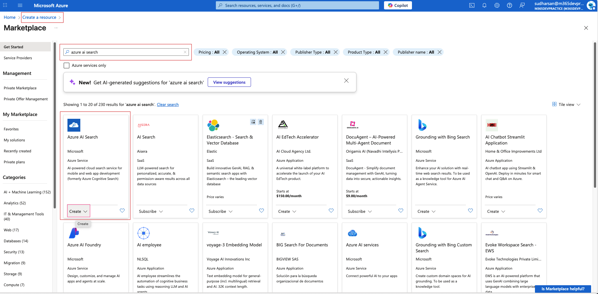
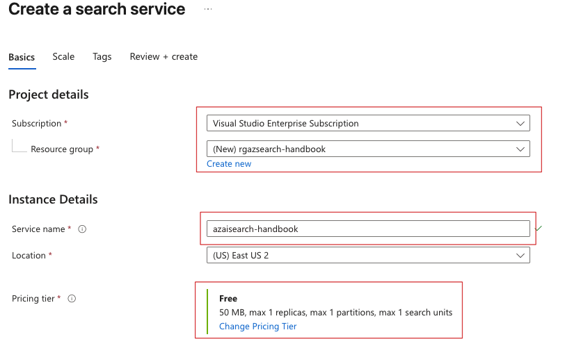
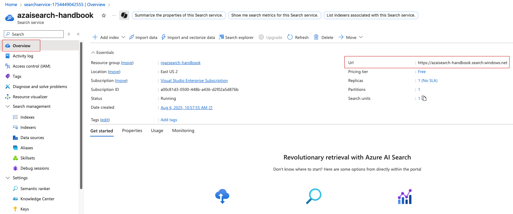
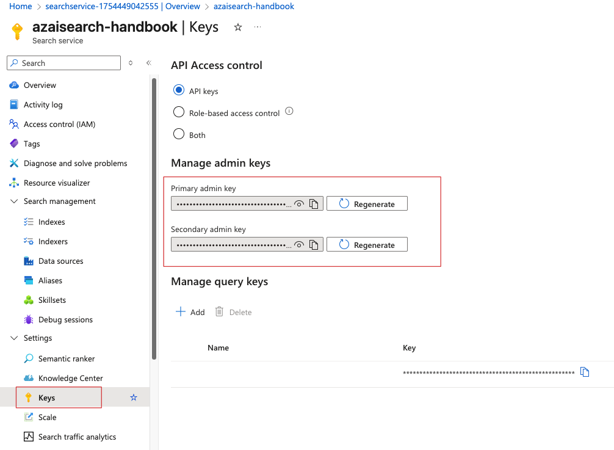
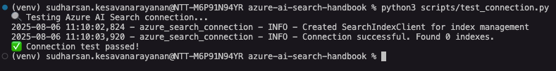

# Azure AI Search Service Setup Guide

This comprehensive guide walks you through setting up an Azure AI Search service for use with the Azure AI Search Handbook.

[Go to top](#azure-ai-search-service-setup-guide)

## Prerequisites

### Technical Requirements
- **Cloud Computing**: Basic understanding of cloud computing concepts and Azure fundamentals
- **Azure Subscription**: An active Azure subscription (free tier provides $200 credit and is sufficient for learning)
- **Development Environment**: 
  - Python 3.8 or higher installed on your local machine
  - Visual Studio Code or preferred IDE
  - Git for version control
- **API Knowledge**: Basic familiarity with REST APIs, JSON, and HTTP methods
- **Programming**: Basic understanding of Python programming concepts

### Recommended Background
- Experience with databases or data storage concepts
- Understanding of web applications and client-server architecture
- Familiarity with Azure portal navigation (helpful but not required)
- Basic knowledge of search concepts (indexing, querying, relevance)

## Option 1: Azure Portal Setup (Recommended for Beginners)

### Step 1: Create Azure AI Search Service

#### Prerequisites Check

Before creating your service, ensure you have:

- An active Azure subscription with sufficient credits/budget
- Appropriate permissions (Contributor or Owner role on the subscription/resource group)
- Decided on the service location based on your users' geography
- Planned your naming convention for consistency

#### Detailed Service Creation Process

1. **Sign in to the Azure Portal**
    - Navigate to [portal.azure.com](https://portal.azure.com)
    - Sign in with your Azure account credentials
    - Verify you're in the correct subscription if you have multiple

2. **Create a new resource**
    - Click "Create a resource" (+) in the top-left corner
    - In the search box, type "Azure AI Search" or "Cognitive Search"
    - Select "Azure AI Search" from the results
    - Click "Create" to start the configuration process



3. **Configure Basic Settings**
   
    - **Subscription and Resource Group:**
        - **Subscription**: Select your Azure subscription
        - **Resource Group**: 
            - Create new: Choose a descriptive name like `rg-search-dev` or `rg-myapp-search`
            - Use existing: Select an appropriate existing resource group
   
    - **Instance Details:**
        - **Service Name**: Choose a globally unique name (3-60 characters, lowercase letters, numbers, hyphens)
            - Examples: `mycompany-search-dev`, `myapp-search-prod`
            - This becomes part of your URL: `https://[service-name].search.windows.net`
        - **Location**: Select based on:
            - **Data residency requirements**: Where your data must be stored
            - **User proximity**: Closest to your primary user base
            - **Service availability**: Not all features available in all regions
            - **Cost considerations**: Pricing may vary by region

4. **Choose Pricing Tier**
   
    - **Free Tier (F0)**:
        - **Cost**: No charge
        - **Limits**: 3 indexes, 50MB storage, 10,000 documents per index
        - **Best for**: Learning, prototyping, small demos
        - **Limitations**: No SLA, limited query volume, no scaling
   
    - **Basic Tier (B)**:
        - **Cost**: ~$250/month
        - **Capacity**: 15 indexes, 2GB storage, 1 million documents per index
        - **Features**: 3 replicas max, 1 partition, 99.9% SLA
        - **Best for**: Small production workloads, development environments
   
    - **Standard Tiers (S1, S2, S3)**:
        - **S1**: ~$250/month, 25GB storage, 12 partitions, 12 replicas
        - **S2**: ~$1000/month, 100GB storage, 12 partitions, 12 replicas  
        - **S3**: ~$2000/month, 200GB storage, 12 partitions, 12 replicas
        - **Features**: Full feature set, high availability, custom scaling
        - **Best for**: Production workloads with varying scale requirements
   
    - **Storage Optimized (L1, L2)**:
        - **L1**: ~$2500/month, 1TB storage, optimized for large document collections
        - **L2**: ~$5000/month, 2TB storage, maximum storage capacity
        - **Best for**: Large-scale document repositories, archival search

5. **Advanced Configuration Options**   
    - **Networking:**
        - **Public endpoint**: Accessible from internet (default)
        - **Private endpoint**: Restrict access to virtual network
        - **IP restrictions**: Limit access to specific IP ranges
   
    - **Identity:**
        - **System-assigned managed identity**: Enable for Azure service integration
        - **User-assigned managed identity**: Use existing managed identity
   
    - **Encryption:**
        - **Microsoft-managed keys**: Default encryption (recommended for most scenarios)
        - **Customer-managed keys**: Use your own encryption keys for additional control



6. **Review and Create**
    - Review all configuration settings
    - Estimate monthly costs using the pricing calculator
    - Add tags for resource organization and cost tracking
    - Click "Create" to deploy the service
    - Deployment typically takes 2-5 minutes

#### Post-Deployment Verification

After deployment completes:

- **Navigate to your service**
    - Go to "All resources" or use the notification to access your service
    - Bookmark the service URL for easy access

- **Verify service status**
    - Check that the service shows "Running" status
    - Note the service URL format: `https://[service-name].search.windows.net`

- **Review service properties**
    - **Overview**: Service URL, status, pricing tier, location
    - **Activity log**: Deployment history and operations
    - **Access control (IAM)**: User permissions and role assignments

[Go to top](#azure-ai-search-service-setup-guide)

### Step 2: Gather Connection Information and Configure Access

#### Service Connection Details

- **Navigate to your search service**
    - From Azure portal home, go to "All resources"
    - Find your search service (filter by type "Search service" if needed)
    - Click on the service name to open the overview page

- **Document your service URL**
    - Found in the "Overview" section under "Url"
    - Format: `https://[your-service-name].search.windows.net`
    - **Important**: This URL is case-sensitive and must be used exactly as shown
    - Test accessibility by opening the URL in a browser (should show a JSON response)



- **Understand API Key Management**
    - Click on "Keys" in the left navigation menu
    - Azure AI Search uses two types of API keys for authentication:

#### API Key Types and Management

- **Admin Keys (Full Access)**
    - **Primary admin key**: Full read/write access to service and data 
    - **Secondary admin key**: Identical permissions, used for key rotation
    - **Capabilities**: 
        - Create, update, delete indexes
        - Upload, modify, delete documents
        - Query data
        - Manage service configuration
    - **Security**: Treat as highly sensitive credentials
    - **Rotation**: Regularly rotate keys (recommended monthly for production)

- **Query Keys (Read-Only Access)**
    - **Default query key**: Automatically created, read-only access
    - **Custom query keys**: Create up to 50 additional query keys
    - **Capabilities**:
        - Search and query operations only
        - Cannot modify indexes or documents
        - Cannot access service configuration
    - **Use cases**: Client-side applications, public-facing search interfaces
    - **Management**: Can be created, named, and deleted as needed



#### Key Rotation Best Practices

- **Implement key rotation strategy**:
    ```bash
    # Example rotation process
    # 1. Update application to use secondary key
    # 2. Regenerate primary key
    # 3. Update application to use new primary key
    # 4. Regenerate secondary key
    ```

- **Monitor key usage**:
    - Use Azure Monitor to track API calls
    - Set up alerts for unusual access patterns
    - Log key usage for security auditing

#### Advanced Authentication Options

- **Azure Active Directory (Azure AD) Authentication**
    - **Setup process**:
        1. Navigate to "Access control (IAM)" in your search service
        2. Click "Add role assignment"
        3. Select appropriate role:
            - **Search Service Contributor**: Full service management
            - **Search Index Data Contributor**: Index and document management
            - **Search Index Data Reader**: Read-only access to data
        4. Assign to users, groups, or service principals

- **Benefits**:
    - No API key management required
    - Integration with existing identity systems
    - Fine-grained role-based access control
    - Audit trail through Azure AD logs

- **Managed Identity Authentication**
    - **System-assigned managed identity**: Automatically created with the service
    - **User-assigned managed identity**: Shared across multiple resources
    - **Configuration**:
        1. Enable managed identity in service "Identity" settings
        2. Grant appropriate permissions to target resources
        3. Use identity for accessing data sources or other Azure services

#### Network Security Configuration

- **IP Restrictions**
    1. Navigate to "Networking" in your search service
    2. Select "Selected networks"
    3. Add IP address ranges that should have access
    4. Consider adding your development machine's IP for testing

- **Private Endpoints**
    1. Click "Private endpoint connections"
    2. Create private endpoint to restrict access to virtual network
    3. Configure DNS resolution for private endpoint
    4. Update applications to use private endpoint URL

- **Firewall Rules**
    - Configure at the service level to restrict access
    - Can be combined with private endpoints for defense in depth
    - Consider impact on indexers accessing external data sources

[Go to top](#azure-ai-search-service-setup-guide)

### Step 3: Set Up Your Development Environment

#### Python Environment Setup

1. **Create a virtual environment (recommended)**
   ```bash
   # Create virtual environment
   python -m venv azure-search-env
   
   # Activate virtual environment
   # On Windows:
   azure-search-env\Scripts\activate
   # On macOS/Linux:
   source azure-search-env/bin/activate
   ```

2. **Install required Python packages**
   ```bash
   # Core Azure AI Search SDK
   pip install azure-search-documents==11.4.0
   
   # Additional useful packages
   pip install python-dotenv==1.0.0      # Environment variable management
   pip install requests==2.31.0          # HTTP requests
   pip install azure-identity==1.15.0    # Azure AD authentication
   pip install azure-core==1.29.0        # Azure SDK core functionality
   pip install pandas==2.1.0             # Data manipulation (optional)
   pip install jupyter==1.0.0            # Jupyter notebooks (optional)
   ```

3. **Create requirements.txt for reproducibility**
   ```bash
   pip freeze > requirements.txt
   ```

#### Environment Configuration

**Create comprehensive .env file**
Create a `.env` file in your project root with all necessary configuration:

```bash
# Azure AI Search Service Configuration
AZURE_SEARCH_SERVICE_ENDPOINT=https://[your-service-name].search.windows.net
AZURE_SEARCH_SERVICE_NAME=[your-service-name]
AZURE_SEARCH_ADMIN_KEY=[your-admin-key]
AZURE_SEARCH_QUERY_KEY=[your-query-key]

# Optional: Azure AD Configuration
AZURE_TENANT_ID=[your-tenant-id]
AZURE_CLIENT_ID=[your-client-id]
AZURE_CLIENT_SECRET=[your-client-secret]

# Development Settings
ENVIRONMENT=development
LOG_LEVEL=INFO
TIMEOUT_SECONDS=30

# Optional: Additional Azure Services
AZURE_STORAGE_CONNECTION_STRING=[for-blob-storage-integration]
AZURE_OPENAI_ENDPOINT=[for-vector-search]
AZURE_OPENAI_API_KEY=[for-embeddings]
```

**Environment file security**
```bash
# Add .env to .gitignore to prevent committing secrets
echo ".env" >> .gitignore
echo "*.env" >> .gitignore
echo "__pycache__/" >> .gitignore
```

#### Comprehensive Connection Testing

**Basic connection test script**
Create `test_connection.py`:

```python
#!/usr/bin/env python3
"""
Comprehensive Azure AI Search connection testing script
"""
import os
import sys
from datetime import datetime
from azure.search.documents import SearchClient
from azure.search.documents.indexes import SearchIndexClient
from azure.core.credentials import AzureKeyCredential
from azure.core.exceptions import AzureError
from dotenv import load_dotenv

def load_configuration():
    """Load and validate configuration from environment"""
    load_dotenv()
    
    config = {
        'endpoint': os.getenv('AZURE_SEARCH_SERVICE_ENDPOINT'),
        'admin_key': os.getenv('AZURE_SEARCH_ADMIN_KEY'),
        'query_key': os.getenv('AZURE_SEARCH_QUERY_KEY'),
        'service_name': os.getenv('AZURE_SEARCH_SERVICE_NAME')
    }
    
    # Validate required configuration
    missing_config = [key for key, value in config.items() 
                     if not value and key != 'query_key']
    
    if missing_config:
        print(f"❌ Missing configuration: {', '.join(missing_config)}")
        print("Please check your .env file")
        return None
    
    return config

def test_service_connection(config):
    """Test basic service connectivity"""
    print("🔍 Testing service connection...")
    
    try:
        # Create index client for service-level operations
        credential = AzureKeyCredential(config['admin_key'])
        index_client = SearchIndexClient(
            endpoint=config['endpoint'],
            credential=credential
        )
        
        # Test service connectivity by getting service statistics
        service_stats = index_client.get_service_statistics()
        
        print("✅ Service connection successful!")
        print(f"   Service endpoint: {config['endpoint']}")
        print(f"   Storage used: {service_stats['storage_size']} bytes")
        print(f"   Document count: {service_stats['document_count']}")
        print(f"   Index count: {service_stats['index_count']}")
        
        return True
        
    except AzureError as e:
        print(f"❌ Service connection failed: {e}")
        return False
    except Exception as e:
        print(f"❌ Unexpected error: {e}")
        return False

def test_authentication_methods(config):
    """Test different authentication methods"""
    print("\n🔐 Testing authentication methods...")
    
    # Test admin key
    try:
        admin_credential = AzureKeyCredential(config['admin_key'])
        admin_client = SearchIndexClient(
            endpoint=config['endpoint'],
            credential=admin_credential
        )
        admin_client.get_service_statistics()
        print("✅ Admin key authentication successful")
    except Exception as e:
        print(f"❌ Admin key authentication failed: {e}")
    
    # Test query key if available
    if config['query_key']:
        try:
            query_credential = AzureKeyCredential(config['query_key'])
            # Query keys can't access service statistics, so we'll test differently
            print("✅ Query key loaded (limited testing without existing index)")
        except Exception as e:
            print(f"❌ Query key authentication failed: {e}")

def test_sdk_functionality(config):
    """Test SDK functionality and features"""
    print("\n🛠️  Testing SDK functionality...")
    
    try:
        credential = AzureKeyCredential(config['admin_key'])
        index_client = SearchIndexClient(
            endpoint=config['endpoint'],
            credential=credential
        )
        
        # Test listing indexes
        indexes = list(index_client.list_indexes())
        print(f"✅ Successfully retrieved {len(indexes)} indexes")
        
        if indexes:
            for idx in indexes[:3]:  # Show first 3 indexes
                print(f"   - Index: {idx.name} ({len(idx.fields)} fields)")
        
        # Test getting service statistics
        stats = index_client.get_service_statistics()
        print(f"✅ Service statistics retrieved")
        
        return True
        
    except Exception as e:
        print(f"❌ SDK functionality test failed: {e}")
        return False

def generate_connection_report(config):
    """Generate a comprehensive connection report"""
    print("\n📊 Connection Report")
    print("=" * 50)
    print(f"Timestamp: {datetime.now().isoformat()}")
    print(f"Service Name: {config['service_name']}")
    print(f"Endpoint: {config['endpoint']}")
    print(f"Admin Key: {'✅ Configured' if config['admin_key'] else '❌ Missing'}")
    print(f"Query Key: {'✅ Configured' if config['query_key'] else '⚠️  Optional'}")
    print("=" * 50)

def main():
    """Main testing function"""
    print("🚀 Azure AI Search Connection Test")
    print("=" * 50)
    
    # Load configuration
    config = load_configuration()
    if not config:
        sys.exit(1)
    
    # Generate report
    generate_connection_report(config)
    
    # Run tests
    tests_passed = 0
    total_tests = 3
    
    if test_service_connection(config):
        tests_passed += 1
    
    test_authentication_methods(config)
    tests_passed += 1  # Authentication test always counts as passed if no exception
    
    if test_sdk_functionality(config):
        tests_passed += 1
    
    # Final results
    print(f"\n🎯 Test Results: {tests_passed}/{total_tests} tests passed")
    
    if tests_passed == total_tests:
        print("🎉 All tests passed! Your Azure AI Search setup is ready.")
        print("\n📋 Next steps:")
        print("1. Create your first search index")
        print("2. Add some sample documents")
        print("3. Perform your first search query")
    else:
        print("⚠️  Some tests failed. Please check your configuration.")
        sys.exit(1)

if __name__ == "__main__":
    main()
```

**Run the connection test**
```bash
python test_connection.py
```



#### Development Tools Setup

- **Visual Studio Code Extensions**
    Install these helpful extensions:
    - **Python**: Microsoft's official Python extension
    - **Azure Account**: Sign in to Azure from VS Code
    - **Azure Resources**: Manage Azure resources
    - **REST Client**: Test REST API calls
    - **JSON**: Enhanced JSON editing and validation

- **Create VS Code workspace settings**
    Create `.vscode/settings.json`:
    ```json
    {
        "python.defaultInterpreterPath": "./azure-search-env/bin/python",
        "python.terminal.activateEnvironment": true,
        "files.exclude": {
            "**/__pycache__": true,
            "**/*.pyc": true,
            ".env": false
        },
        "python.linting.enabled": true,
        "python.linting.pylintEnabled": true,
        "python.formatting.provider": "black"
    }
    ```

#### Project Structure Setup

**Create organized project structure**
```bash
mkdir -p azure-search-project/{src,tests,docs,examples,data}
cd azure-search-project

# Create initial files
touch src/__init__.py
touch tests/__init__.py
touch README.md
touch requirements.txt
```

**Example project structure**:
```
azure-search-project/
├── .env                    # Environment configuration
├── .gitignore             # Git ignore rules
├── requirements.txt       # Python dependencies
├── README.md             # Project documentation
├── test_connection.py    # Connection testing script
├── src/                  # Source code
│   ├── __init__.py
│   ├── search_client.py  # Search client wrapper
│   └── utils.py          # Utility functions
├── tests/                # Test files
│   ├── __init__.py
│   └── test_search.py    # Unit tests
├── examples/             # Example scripts
│   ├── basic_search.py
│   └── index_management.py
├── docs/                 # Documentation
└── data/                 # Sample data files
```

[Go to top](#azure-ai-search-service-setup-guide)

[Go to top](#azure-ai-search-service-setup-guide)

## Option 2: Azure CLI Setup (Advanced)

### Prerequisites
- Install Azure CLI: [docs.microsoft.com/cli/azure/install-azure-cli](https://docs.microsoft.com/cli/azure/install-azure-cli)

### Step 1: Login and Setup

```bash
# Login to Azure
az login

# Set your subscription (if you have multiple)
az account set --subscription "Your Subscription Name"

# Create a resource group (optional)
az group create --name "rg-search-handbook" --location "East US"
```

### Step 2: Create Search Service

```bash
# Create the search service
az search service create \
  --name "your-unique-service-name" \
  --resource-group "rg-search-handbook" \
  --sku "free" \
  --location "East US"
```

### Step 3: Get Connection Details

```bash
# Get the endpoint
az search service show \
  --name "your-unique-service-name" \
  --resource-group "rg-search-handbook" \
  --query "hostName" -o tsv

# Get the admin key
az search admin-key show \
  --service-name "your-unique-service-name" \
  --resource-group "rg-search-handbook" \
  --query "primaryKey" -o tsv
```

[Go to top](#azure-ai-search-service-setup-guide)

## Option 3: Using Azure Resource Manager (ARM) Template

For automated deployment, use the provided ARM template:

### Step 1: Deploy Template

```bash
# Clone the repository if you haven't already
git clone <repository-url>
cd azure-ai-search-handbook

# Deploy using Azure CLI
az deployment group create \
  --resource-group "rg-search-handbook" \
  --template-file "deployment/azure-search-template.json" \
  --parameters serviceName="your-unique-service-name" \
               sku="free" \
               location="East US"
```

### Step 2: Get Outputs

```bash
# Get the deployment outputs
az deployment group show \
  --resource-group "rg-search-handbook" \
  --name "azure-search-template" \
  --query "properties.outputs"
```

## Authentication Methods and Security

Azure AI Search supports multiple authentication methods, each suited for different scenarios and security requirements.

### 1. API Keys (Recommended for Development and Simple Scenarios)

#### Admin Keys
- **Purpose**: Full administrative access to the search service
- **Capabilities**: 
    - Create, update, delete indexes and indexers
    - Upload, modify, delete documents
    - Query data and retrieve results
    - Manage service configuration and settings
    - Access service statistics and diagnostics
- **Key Management**: 
    - Two admin keys provided (primary and secondary)
    - Enable zero-downtime key rotation
    - Keys are 32-character alphanumeric strings
- **Security Considerations**:
    - Treat as highly sensitive credentials
    - Never embed in client-side code
    - Store securely using Azure Key Vault or environment variables
    - Rotate regularly (monthly recommended for production)

#### Query Keys
- **Purpose**: Read-only access for search operations
- **Capabilities**:
    - Search and query operations only
    - Retrieve documents and search results
    - Access auto-complete and suggestions
    - Cannot modify indexes or documents
- **Key Management**:
    - Up to 50 query keys per service
    - Can be named for easier management
    - Can be created and deleted as needed
    - Default query key created automatically
- **Use Cases**:
    - Client-side applications and websites
    - Mobile applications
    - Public-facing search interfaces
    - Third-party integrations with read-only access

**Implementation Example**:
```python
from azure.search.documents import SearchClient
from azure.core.credentials import AzureKeyCredential

# Admin key usage (server-side only)
admin_credential = AzureKeyCredential("your-admin-key")
admin_client = SearchClient(
    endpoint="https://your-service.search.windows.net",
    index_name="your-index",
    credential=admin_credential
)

# Query key usage (can be used client-side)
query_credential = AzureKeyCredential("your-query-key")
search_client = SearchClient(
    endpoint="https://your-service.search.windows.net",
    index_name="your-index",
    credential=query_credential
)
```

### 2. Azure Active Directory (Azure AD) - Recommended for Production

#### Overview
Azure AD authentication provides enterprise-grade security with role-based access control (RBAC) and integration with existing identity systems.

#### Built-in Roles
- **Search Service Contributor**: Full service management capabilities
- **Search Index Data Contributor**: Read/write access to indexes and documents
- **Search Index Data Reader**: Read-only access to search data
- **Reader**: View service properties and statistics only

#### Setup Process
1. **Enable Azure AD authentication**:
   ```bash
   # Using Azure CLI
   az search service update \
     --name "your-search-service" \
     --resource-group "your-resource-group" \
     --aad-auth-failure-mode "http401WithBearerChallenge"
   ```

2. **Assign roles to users/applications**:
   ```bash
   # Assign Search Index Data Reader role
   az role assignment create \
     --assignee "user@domain.com" \
     --role "Search Index Data Reader" \
     --scope "/subscriptions/{subscription-id}/resourceGroups/{resource-group}/providers/Microsoft.Search/searchServices/{service-name}"
   ```

#### Implementation Examples

**Using DefaultAzureCredential (Recommended)**:
```python
from azure.search.documents import SearchClient
from azure.identity import DefaultAzureCredential

# Automatically uses available credentials (managed identity, Azure CLI, etc.)
credential = DefaultAzureCredential()
client = SearchClient(
    endpoint="https://your-service.search.windows.net",
    index_name="your-index",
    credential=credential
)
```

**Using Service Principal**:
```python
from azure.search.documents import SearchClient
from azure.identity import ClientSecretCredential

credential = ClientSecretCredential(
    tenant_id="your-tenant-id",
    client_id="your-client-id",
    client_secret="your-client-secret"
)

client = SearchClient(
    endpoint="https://your-service.search.windows.net",
    index_name="your-index",
    credential=credential
)
```

### 3. Managed Identity (Recommended for Azure-hosted Applications)

#### System-Assigned Managed Identity
- **Characteristics**: Tied to the lifecycle of the Azure resource
- **Use Cases**: Azure Functions, App Service, Virtual Machines
- **Benefits**: No credential management, automatic cleanup

**Enable system-assigned managed identity**:
```bash
# For Azure App Service
az webapp identity assign \
  --name "your-app-name" \
  --resource-group "your-resource-group"
```

**Implementation with Managed Identity**:
```python
from azure.search.documents import SearchClient
from azure.identity import ManagedIdentityCredential

# System-assigned managed identity
credential = ManagedIdentityCredential()

client = SearchClient(
    endpoint="https://your-service.search.windows.net",
    index_name="your-index",
    credential=credential
)
```

[Go to top](#azure-ai-search-service-setup-guide)

## Pricing Tiers Comparison

| Tier | Price | Search Units | Storage | Indexes | Indexers | Documents per Index | Best For |
|------|-------|--------------|---------|---------|----------|-------------------|----------|
| **Free (F0)** | Free | 3 | 50 MB | 3 | 3 | 10,000 | Learning, tutorials |
| **Basic (B)** | ~$250/month | 3 | 2 GB | 15 | 15 | 1 million | Development, small apps |
| **Standard S1** | ~$250/month | 36 | 25 GB | 50 | 50 | 15 million | Production apps |
| **Standard S2** | ~$1000/month | 36 | 100 GB | 200 | 200 | 60 million | Large production apps |
| **Standard S3** | ~$2000/month | 36 | 200 GB | 200 | 200 | 60 million | High-scale production |
| **Storage L1** | ~$2500/month | 36 | 1 TB | 10 | 10 | 120 million | Large document collections |
| **Storage L2** | ~$5000/month | 36 | 2 TB | 10 | 10 | 120 million | Maximum storage capacity |

> **💡 Tip**: Start with the **Free** tier for learning. You can always upgrade later.

## Security Best Practices

### Key Management
1. **Use Azure Key Vault** for storing API keys and secrets
2. **Implement key rotation** policies and procedures
3. **Monitor key usage** through Azure Monitor and logging
4. **Separate keys by environment** (development, staging, production)

### Access Control
1. **Principle of least privilege**: Grant minimum necessary permissions
2. **Use query keys** for client-side and read-only scenarios
3. **Implement IP restrictions** to limit access by location
4. **Enable private endpoints** for network-level security

### Network Security
- **Private Endpoints**: For production, consider using private endpoints
- **IP Restrictions**: Limit access to specific IP addresses
- **CORS Settings**: Configure CORS for web applications
- **Firewall Rules**: Configure service-level access restrictions

### Authentication Decision Matrix

| Scenario | Recommended Method | Rationale |
|----------|-------------------|-----------|
| Development/Testing | API Keys | Simple setup, easy debugging |
| Production Web App | Azure AD + Managed Identity | No credential management, enterprise security |
| Client-side Search | Query Keys | Read-only access, safe for public exposure |
| Azure Functions | System-assigned Managed Identity | Automatic credential management |
| Multi-service App | User-assigned Managed Identity | Shared identity across services |
| On-premises Integration | Service Principal | Works across hybrid environments |

[Go to top](#azure-ai-search-service-setup-guide)

## Troubleshooting

### Quick Fixes for Common Issues

1. **"Service name already exists"**
   - Service names must be globally unique
   - Try adding numbers or your initials: `my-search-service-abc123`

2. **"Quota exceeded"**
   - Free tier allows only one service per subscription
   - Delete existing free service or upgrade to paid tier

3. **"Connection failed"**
   - Check your endpoint URL (should start with `https://`)
   - Verify your API key is correct
   - Ensure the service is running (check Azure portal)

4. **"Access denied"**
   - Make sure you're using an admin key, not a query key
   - Check if IP restrictions are blocking your connection

### Testing Your Setup

1. **Basic connection test**
   ```bash
   python3 scripts/test_connection.py
   ```

2. **Detailed connection test**
   ```bash
   python3 setup/setup_cli.py test --verbose
   ```

3. **Check service status**
   ```bash
   python3 setup/setup_cli.py status
   ```

### Comprehensive Troubleshooting

For detailed troubleshooting guidance covering connection issues, authentication problems, performance optimization, and more, see the [Comprehensive Troubleshooting Guide](../reference/troubleshooting.md).

### Getting Help

- **Azure Documentation**: [docs.microsoft.com/azure/search](https://docs.microsoft.com/azure/search)
- **Azure Support**: Available through Azure portal
- **Community Forums**: [Microsoft Q&A](https://docs.microsoft.com/answers/topics/azure-search.html)

[Go to top](#azure-ai-search-service-setup-guide)

## Next Steps

Once your Azure AI Search service is set up:

1. **Test the connection**: `python3 scripts/test_connection.py`
2. **Generate sample data**: `python3 scripts/generate_sample_data.py`
3. **Start learning**: Begin with [Module 1: Introduction and Setup](../beginner/module-01-introduction-setup/documentation.md)
4. **Run Jupyter notebooks**: `jupyter notebook`

### Ready to Learn More?

Your Azure AI Search service is now ready! Continue your learning journey:

- **[Module 1: Introduction and Setup](../beginner/module-01-introduction-setup/documentation.md)** - Deep dive into Azure AI Search concepts
- **[Module 2: Basic Search Operations](../beginner/module-02-basic-search-operations/documentation.md)** - Create indexes and perform searches
- **[Troubleshooting Guide](../reference/troubleshooting.md)** - Comprehensive problem-solving resource

[Go to top](#azure-ai-search-service-setup-guide)

## Cost Management

### Monitoring Costs

1. **Set up billing alerts** in the Azure portal
2. **Monitor usage** in the search service metrics
3. **Use cost analysis** tools in Azure portal

### Cost Optimization Tips

- **Start with Free tier** for learning
- **Delete unused indexes** to save storage
- **Monitor search unit usage** and scale down if needed
- **Use query keys** instead of admin keys when possible
- **Clean up test resources** regularly

[Go to top](#azure-ai-search-service-setup-guide)

## Advanced Configuration

### Custom Domain (Optional)

For production applications, you might want to use a custom domain:

1. Set up Azure Front Door or Application Gateway
2. Configure SSL certificates
3. Update DNS records
4. Test the custom endpoint

### Backup and Disaster Recovery

- **Index backups**: Use the backup/restore utilities
- **Multi-region deployment**: For high availability
- **Data replication**: Consider Azure Storage replication options

---

## Quick Reference

### Essential URLs
- **Azure Portal**: [portal.azure.com](https://portal.azure.com)
- **Azure CLI Docs**: [docs.microsoft.com/cli/azure](https://docs.microsoft.com/cli/azure)
- **Azure AI Search Docs**: [docs.microsoft.com/azure/search](https://docs.microsoft.com/azure/search)

### Key Commands
```bash
# Test connection
python3 scripts/test_connection.py

# Check status
python3 setup/setup_cli.py status

# Generate sample data
python3 scripts/generate_sample_data.py
```

### Environment Variables
```bash
AZURE_SEARCH_SERVICE_ENDPOINT=https://your-service.search.windows.net
AZURE_SEARCH_API_KEY=your-api-key
AZURE_SEARCH_INDEX_NAME=your-index-name
```